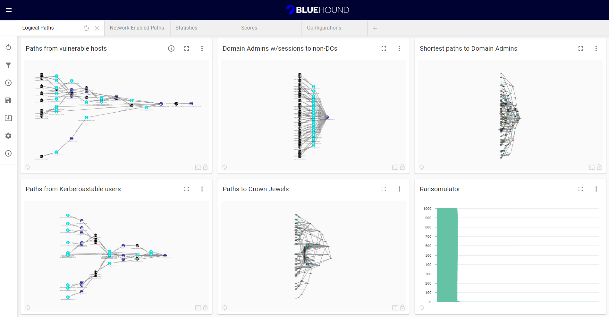

 

 
BlueHound is an open-source tool that helps blue teams pinpoint the security issues that actually matter. By combining information about user permissions, network access and unpatched vulnerabilities, BlueHound reveals the paths attackers would take if they were inside your network 
It is a fork of NeoDash, reimagined, to make it suitable for defensive security purposes.

To get started with BlueHound, check out our [introductory video](https://youtu.be/WVup5tnURoM) and [blog post](https://zeronetworks.com/blog/bluehound-community-driven-resilience/).
  

BlueHound supports presenting your data as tables, graphs, bar charts, line charts, maps and more. It contains a Cypher editor to directly write the Cypher queries that populate the reports. You can save dashboards to your database, and share them with others.

## Main Features
1. **Full Automation**: The entire cycle of collection, analysis and reporting is basically done with a click of a button.
2. **Community Driven**: BlueHound configuration can be exported and imported by others. Sharing of knowledge, best practices, collection methodologies and more, built-into the tool itself.
3. **Easy Reporting**: Creating customized report can be done intuitively, without the need to write any code.
4. **Easy Customization**: Any custom collection method can be added into BlueHound. Users can even add their own custom parameters or even custom icons for their graphs.

## Getting Started
1. Connect to your Neo4j server
2. Download [SharpHound](https://github.com/BloodHoundAD/BloodHound/blob/master/Collectors/SharpHound.exe), [ShotHound](https://github.com/zeronetworks/BloodHound-Tools/tree/main/ShotHound) and the [Vulnerability Scanner report parser](https://github.com/zeronetworks/BloodHound-Tools/tree/main/VulnerabilitiesDataImport)
3. Use the **Data Import** section to collect & import data into your Neo4j database.
4. Once you have data loaded, you can use the **Configurations** tab to set up the basic information
that is used by the queries (e.g. Domain Admins group, crown jewels servers).
5. Finally, the **Queries** section can be used to prepare the reports.

# BlueHound How-To
## Data Collection
The **Data Import Tools** section can be used to collect data in a click of a button. By default, BlueHound comes preconfigured with SharpHound, ShotHound, and the Vulnerability Scanners script. Additional tools can be added for more data collection. To get started:
1. Download the relevant tools using the globe icon
2. Configure the tool path & arguments for each tool
3. Run the tools

The built-in tools can be configured to automatically upload the results to your Neo4j instance.
## Running & Viewing Queries
To get results for a chart, either use the Refresh icon to run a specific query, or use the **Query Runner** section to run queries in batches. The results will be cached even after closing BlueHound, and can be run again to get updated results. 
Some charts have an *Info* icon which explain the query and/or provide links to additional information.
## Adding & Editing Queries
You can edit the query for new and/or existing charts by using the Settings icon on the top right section of the chart. Here you can use any parameters configured with a *Param Select* chart, and any *Edge Filtering* string (see section below). 
## Edge Filtering
Using the **Edge Filtering** section, you can filter out specific relationship types for all queries that use the relevant string in their query. For example, ":FILTERED_EDGES" can be used to filter by all the selection filters.  
You can also filter by a specific category (see the *Info* icon) or even define your own custom edge filters.
## Import & Export Config
The **Export Config** and **Import Config** sections can be used to save & load your dashboard and configurations as a backup, and even shared between users to collaborate and contribute insightful queries to the security community. Don’t worry, your credentials and data won’t be exported.  
***Note: any arguments for data import tools are also exported, so make sure you remove any secrets before sharing your configuration.*** 
## Settings
The Settings section allows you to set some global limits on query execution – maximum query time and a limit for returned results.

# Technical Info
BlueHound is a fork of [NeoDash](https://github.com/neo4j-labs/neodash), built with [React](https://reactjs.org/) and [use-neo4j](https://github.com/adam-cowley/use-neo4j).
It uses [charts](https://github.com/neo4j-labs/charts) to power some of the visualizations.
You can also extend NeoDash with your own visualizations. Check out the developer guide in the [project repository](https://github.com/neo4j-labs/neodash).

# Developer Guide

## Run & Build using npm
BlueHound is built with React. You'll need `npm` installed to run the web app.

> Use a recent version of `npm` and `node` to build BlueHound. The application has been tested with npm 8.3.1 & node v17.4.0.

To run the application in development mode:
- clone this repository.
- open a terminal and navigate to the directory you just cloned.
- execute `npm install` to install the necessary dependencies.
- execute `npm run dev` to run the app in development mode.
- the application should be available at http://localhost:3000.

To build the app for production:
- follow the steps above to clone the repository and install dependencies.
- execute `npm run build`. This will create a `build` folder in your project directory.
- deploy the contents of the build folder to a web server. You should then be able to run the web app.

## Questions / Suggestions
We are always open to ideas, comments, and suggestions regarding future versions of BlueHound, so if you have ideas, don’t hesitate to reach out to us at [support@zeronetworks.com](mailto:support@zeronetworks.com) or open an issue/pull request on GitHub.
